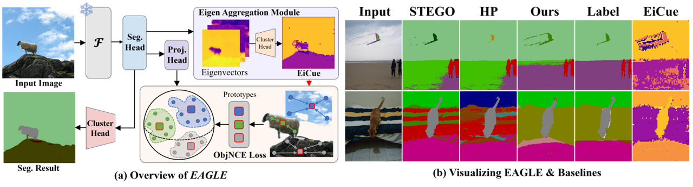

# EAGLE :eagle:: Eigen Aggregation Learning for Object-Centric Unsupervised Semantic Segmentation
#### Highlight @ CVPR 2024 
[](https://paperswithcode.com/sota/unsupervised-semantic-segmentation-on-coco-7?p=eagle-eigen-aggregation-learning-for-object)  
[](https://paperswithcode.com/sota/unsupervised-semantic-segmentation-on?p=eagle-eigen-aggregation-learning-for-object)  
[](https://paperswithcode.com/sota/unsupervised-semantic-segmentation-on-potsdam-1?p=eagle-eigen-aggregation-learning-for-object)  

EAGLE's code is coming soon!  
[[Project Page]](https://micv-yonsei.github.io/eagle2024/) [[arXiv]](https://arxiv.org/abs/2403.01482)  
<br>

> #### **EAGLE: Eigen Aggregation Learning for Object-Centric Unsupervised Semantic Segmentation**<be>  
>IEEE/CVF Conference on Computer Vision and Pattern Recognition (CVPR) 2024  
>Chanyoung Kim*, Woojung Han*, Dayun Ju, Seong Jae Hwang  
>Yonsei University
### Abstract
Semantic segmentation has innately relied on extensive pixel-level annotated data, leading to the emergence of unsupervised methodologies. Among them, leveraging self-supervised Vision Transformers for unsupervised semantic segmentation (USS) has been making steady progress with expressive deep features. Yet, for semantically segmenting images with complex objects, a predominant challenge remains: the lack of explicit object-level semantic encoding in patch-level features. This technical limitation often leads to inadequate segmentation of complex objects with diverse structures. To address this gap, we present a novel approach, **EAGLE**, which emphasizes object-centric representation learning for unsupervised semantic segmentation. Specifically, we introduce EiCue, a spectral technique providing semantic and structural cues through an eigenbasis derived from the semantic similarity matrix of deep image features and color affinity from an image. Further, by incorporating our object-centric contrastive loss with EiCue, we guide our model to learn object-level representations with intra- and inter-image object-feature consistency, thereby enhancing semantic accuracy. Extensive experiments on COCO-Stuff, Cityscapes, and Potsdam-3 datasets demonstrate the state-of-the-art USS results of EAGLE with accurate and consistent semantic segmentation across complex scenes.


## :eagle: About EAGLE

### Eigenvectors
Visualizing eigenvectors derived from S in the Eigen Aggregation Module. These eigenvectors not only distinguish different objects but also identify semantically related areas, highlighting how EiCue captures object semantics and boundaries effectively.


### EiCue
Comparison between K-means and EiCue. The bottom row presents EiCue, highlighting its superior ability to capture subtle structural intricacies and understand deeper semantic relationships, which is not as effectively achieved by K-means.


### EAGLE Architecture
The pipeline of **EAGLE**. Leveraging the Laplacian matrix, which integrates hierarchically projected image key features and color affinity, the model harnesses eigenvector clustering to capture an object-centric perspective. Our model further adopts an object-level contrastive loss, utilizing the projected vector Z and ̃Z. The learnable prototype Φ, acts as a singular anchor that contrasts positive objects and negative objects. Our object-level contrastive loss is computed in two distinct manners: crosswise and non-crosswise to ensure semantic consistency.


### Results
We evaluate the EAGLE algorithm on the CocoStuff, Cityscapes, and Potsdam-3 datasets.


## Citation
If you found this code useful, please cite the following paper:  
```
@InProceedings{2024eagle,
    author    = {Kim, Chanyoung and Han, Woojung and Ju, Dayun and Hwang, Seong Jae},
    title     = {EAGLE: Eigen Aggregation Learning for Object-Centric Unsupervised Semantic Segmentation},
    booktitle = {Proceedings of the IEEE/CVF Conference on Computer Vision and Pattern Recognition (CVPR)},
    month     = {June},
    year      = {2024}
}
```

## :scroll: Acknowledgement
This repository has been developed based on the [STEGO](https://github.com/mhamilton723/STEGO) repository. Thanks for the good work!
